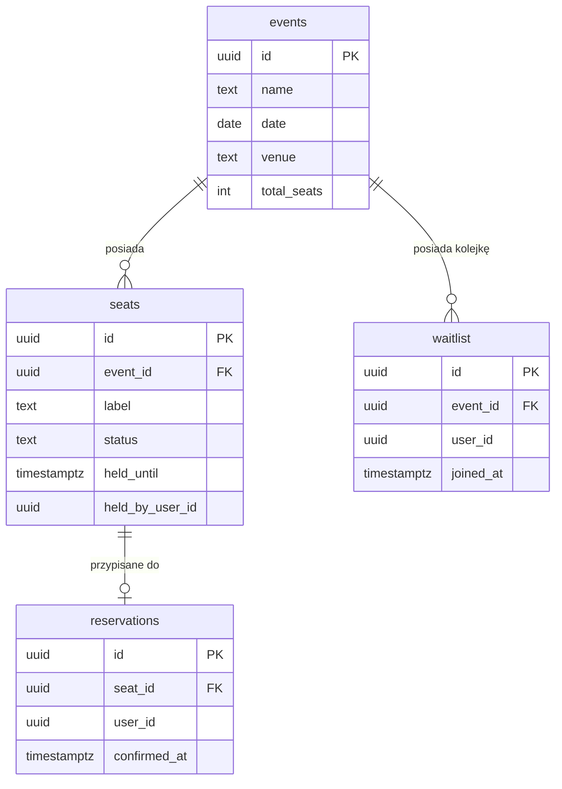

# Dokumentacja projektu – system rezerwacji biletów w czasie rzeczywistym

Projekt zrealizowany na zaliczenie przedmiotu **Bazy Danych 2** (semestr letni 2025/2026).

**Autorzy:** Stanisław Ogonowski, Antoni Chmiela

---

## 1. Cel projektu i wybór technologii

Celem było zbudowanie systemu rezerwacji biletów na wydarzenia o wysokim popycie, gdzie wielu użytkowników jednocześnie próbuje zająć te same miejsca. Głównym wyzwaniem było zapobieganie podwójnym rezerwacjom przy dużym natężeniu ruchu bez niepotrzebnego ograniczania przepustowości.

Gdy brakuje wolnych miejsc, system nie odrzuca żądania – zamiast tego zapisuje użytkownika na listę oczekujących. Tymczasowa blokada miejsca (hold) wygasa po 30 sekundach, jeśli użytkownik nie dokona płatności. Proces sprzątający działający w tle wykrywa wygasłe blokady i automatycznie przydziela zwolnione miejsca pierwszym osobom z kolejki.

Stos technologiczny:

- PostgreSQL 16 – sprawdzony system relacyjny z dojrzałymi mechanizmami blokowania na poziomie wierszy, w szczególności klauzulą `FOR UPDATE SKIP LOCKED`, która jest kluczowa dla modelu współbieżności w tym projekcie.
- Rust (backend) – wybrany ze względu na bezpieczeństwo pamięciowe i wysoką wydajność przetwarzania asynchronicznego. Warstwa HTTP opiera się na frameworku **axum**, a dostęp do bazy danych realizuje biblioteka **sqlx**, która weryfikuje poprawność zapytań SQL na etapie kompilacji.
- Rust + Leptos v0.6 (frontend) – interfejs użytkownika skompilowany do WebAssembly, budowany i serwowany przez narzędzie **Trunk**. Użycie Rusta w całym projekcie zapewnia spójny ekosystem.
- Docker i Docker Compose – całe środowisko (baza danych, backend, frontend) uruchamia się jednym poleceniem.

---

## 2. Model danych

Schemat jest celowo prosty – logika biznesowa tkwi w transakcjach i zapytaniach, nie w strukturze tabel.



Baza danych składa się z czterech tabel:

- `events` – nazwa, data, miejsce oraz całkowita liczba miejsc danego wydarzenia.
- `seats` – jeden wiersz na każde miejsce. Kolumna `status` przyjmuje wartości `available`, `held` lub `sold`. Przy statusie `held` kolumny `held_by_user_id` oraz `held_until` przechowują informację o tym, kto blokuje dane miejsce i kiedy blokada wygasa.
- `reservations` – aktywne rezerwacje powiązane z miejscem i użytkownikiem.
- `waitlist` – wpisy na liście oczekujących. Kolumna `joined_at` zapewnia obsługę kolejki w porządku FIFO.

Wdrożone indeksy:

- `idx_seats_event_status` na `(event_id, status)` – przyspiesza wyszukiwanie wolnych miejsc dla danego wydarzenia.
- `idx_waitlist_event_joined` na `(event_id, joined_at)` – optymalizuje pobieranie kolejnego użytkownika z waitlisty.
- `idx_reservations_seat` na `seat_id` – przyspiesza złączenia przy weryfikacji rezerwacji.

---

## 3. Operacje bazodanowe i kontrola współbieżności

Wszystkie operacje modyfikujące stan bazy danych wykonywane są w ramach transakcji na poziomie izolacji `Read Committed`.

### Pobieranie listy wydarzeń

Endpoint z listą wydarzeń zwraca statystyki miejsc dla każdego wydarzenia w jednym zagregowanym zapytaniu:

```sql
SELECT
    e.id,
    e.name,
    TO_CHAR(e.date, 'YYYY-MM-DD') AS date,
    e.venue,
    e.total_seats,
    COUNT(CASE WHEN s.status = 'available' THEN 1 END) AS available_seats,
    COUNT(CASE WHEN s.status = 'held'      THEN 1 END) AS held_seats,
    COUNT(CASE WHEN s.status = 'sold'      THEN 1 END) AS sold_seats,
    (SELECT COUNT(*) FROM waitlist w WHERE w.event_id = e.id) AS waitlist_count
FROM events e
LEFT JOIN seats s ON s.event_id = e.id
GROUP BY e.id, e.name, e.date, e.venue, e.total_seats
ORDER BY e.date ASC
```

Złączenie `LEFT JOIN` z wyrażeniami `COUNT(CASE WHEN...)` wyznacza liczby miejsc o każdym statusie w jednym przebiegu. Rozmiar kolejki pochodzi ze skorelowanego podzapytania.

---

### Rezerwacja miejsca i mechanizm `SKIP LOCKED`

Gdy użytkownik prosi o dowolne wolne miejsce (bez wskazania konkretnego numeru), transakcja wykonuje:

```sql
SELECT id FROM seats
WHERE event_id = $1 AND status = 'available'
LIMIT 1
FOR UPDATE SKIP LOCKED
```

`SKIP LOCKED` jest tu kluczowym mechanizmem. Zwykłe `FOR UPDATE` powodowałoby, że współbieżne transakcje czekałyby w kolejce na odblokowanie pierwszego napotkanego wiersza, tworząc wąskie gardło. `SKIP LOCKED` nakazuje PostgreSQL pominąć wiersze już zablokowane przez inne transakcje i natychmiast zwrócić kolejny wolny wiersz – żądania obsługiwane są równolegle zamiast szeregowo.

Gdy użytkownik wybiera konkretne miejsce po ID, zapytanie używa zwykłego `FOR UPDATE` (bez `SKIP LOCKED`), ponieważ jest tylko jeden kandydujący wiersz i transakcja powinna na niego poczekać, a nie go pominąć.

Po znalezieniu wolnego miejsca transakcja:
1. Ustawia `status = 'held'`, uzupełnia `held_until = now() + 30s` i `held_by_user_id`.
2. Wstawia wiersz do tabeli `reservations`.
3. Wysyła `pg_notify` na kanał `seat_change` (opisany w sekcji 4).
4. Zatwierdza transakcję (`COMMIT`).

Odpowiedź to `201 Created` z ID rezerwacji i miejsca. Jeśli żadne miejsce nie zostało znalezione, użytkownik trafia do `waitlist` i zwracane jest `202 Accepted`.

---

### Opłacenie rezerwacji

Opłacenie biletu wymaga weryfikacji, że blokada jest nadal ważna:

```sql
SELECT s.id, s.event_id, s.status, s.held_by_user_id, s.held_until < $2 AS expired
FROM reservations r
JOIN seats s ON s.id = r.seat_id
WHERE r.id = $1
FOR UPDATE OF s
```

Klauzula `FOR UPDATE OF s` blokuje wiersz miejsca, uniemożliwiając procesowi sprzątającemu wygaszenie go między odczytem a aktualizacją. Jeśli `status = 'held'`, `held_by_user_id` zgadza się z żądającym użytkownikiem i `expired = false`, miejsce zostaje zaktualizowane do `sold`, pola blokady wyczyszczone, a transakcja zatwierdzona. W przeciwnym razie endpoint zwraca `409 Conflict` (nieprawidłowy właściciel lub status) albo `403 Forbidden` (blokada wygasła).

---

### Proces sprzątający (sweeper)

Asynchroniczne zadanie Tokio uruchamiane co 5 sekund zwalnia przeterminowane blokady i awansuje użytkowników z waitlisty. Baza danych jest jedynym źródłem prawdy dla czasu blokad – backend nie przechowuje żadnych timerów w pamięci, co czyni go bezstanowym i bezpiecznym do restartu.

Każda iteracja sprzątania przetwarza jedno wygasłe miejsce:

1. Pobierane jest jedno przeterminowane miejsce (`status = 'held'` i `held_until < now()`) z blokadą `FOR UPDATE SKIP LOCKED`.
2. Pobierany jest najstarszy wpis z waitlisty dla danego wydarzenia (`ORDER BY joined_at ASC LIMIT 1`) z blokadą `FOR UPDATE SKIP LOCKED`.
3. Jeśli użytkownik oczekuje w kolejce: aktualizowane są `held_by_user_id` oraz `held_until` miejsca (status pozostaje `held`), aktualizowane jest `user_id` rezerwacji, a wpis z waitlisty zostaje usunięty.
4. Jeśli kolejka jest pusta: status miejsca wraca do `available`, pola blokady są czyszczone, a wiersz rezerwacji usuwany.
5. Transakcja jest zatwierdzana.

Przetwarzanie jednego miejsca per transakcja ogranicza zakres blokad i zapobiega ich długiemu utrzymywaniu przy dużym obciążeniu.

---

## 4. Frontend

Frontend to single-page app napisana w Leptos, frameworku webowym Rusta. Dane odświeżane są przez odpytywanie API w tle: lista wydarzeń co 3 sekundy, siatka miejsc co 2 sekundy. Główne funkcje:

- Panel tożsamości – nagłówek wyświetla bieżący User ID. Użytkownik może wygenerować nowy losowy UUID lub wpisać własny. Identyfikator jest persystowany w `localStorage`.
- Siatka miejsc – pokazuje wszystkie miejsca wybranego wydarzenia z oznaczeniem kolorystycznym: zielone (wolne), pomarańczowe (zablokowane przez inną osobę), niebieskie (zablokowane przez bieżącego użytkownika), czerwone (sprzedane). Kliknięcie wolnego miejsca inicjuje rezerwację konkretnego siedzenia.
- Baner blokady – gdy bieżący użytkownik zajmuje miejsce, pojawia się odliczanie MM:SS i przycisk płatności. Licznik aktualizuje się co 200 ms na podstawie pola `held_until` zwróconego przez API.
- Baner waitlisty – gdy użytkownik jest w kolejce dla wybranego wydarzenia, wyświetlany jest stosowny komunikat. Przy kolejnym odświeżeniu siatki miejsc, jeśli bieżący użytkownik ma już przydzieloną blokadę, frontend automatycznie usuwa stan waitlisty i wyświetla powiadomienie o sukcesie.
- Powiadomienia toast – krótkie komunikaty (sukces / ostrzeżenie / błąd) znikają automatycznie po 4 sekundach.

### Procedura ręcznej weryfikacji współbieżności

1. Otworzyć aplikację w dwóch osobnych kartach przeglądarki.
2. W pierwszej karcie zarezerwować dowolne miejsce. Przechodzi ono w stan „held" i rozpoczyna się odliczanie 30 sekund.
3. W drugiej karcie kliknąć „Nowy", aby wygenerować inny User ID. To samo miejsce widoczne jest jako zajęte przez innego użytkownika.
4. W drugiej karcie kliknąć „Zapisz się do kolejki". Pojawia się potwierdzenie dodania do waitlisty.
5. Pozwolić upłynąć 30 sekundom w pierwszej karcie bez dokonywania płatności.
6. Proces sprzątający wykryje wygasłą blokadę i przydzieli miejsce użytkownikowi z drugiej karty. W drugiej karcie pojawi się powiadomienie, a odliczanie zacznie się od nowa.

---

## 5. Generator obciążenia (loadgen)

Crate `loadgen` to narzędzie wiersza poleceń do testowania wydajności backendu rezerwacji.

### Uruchomienie

```shell
cargo run -p loadgen -- [OPCJE]
```

### Dostępne opcje

| Flaga | Domyślnie | Opis |
|---|---|---|
| `--base-url <URL>` | `http://localhost:3000` | Adres backendu. |
| `--rpm <N>` | `60` | Docelowa liczba żądań rezerwacji na minutę. |
| `--concurrency <N>` | `32` | Maksymalna liczba żądań jednocześnie w locie. Po przekroczeniu limitu nadmiarowe takty są pomijane, a nie kolejkowane. |
| `--duration <CZAS>` | `60s` | Czas działania generatora (np. `30s`, `5m`). |
| `--event <UUID>` | *(cztery UUID z seed.sql)* | UUID wydarzenia do obciążenia. Opcja wielokrotna; podanie wielu wartości rozkłada ruch. Domyślnie używane są cztery wydarzenia z pliku `seed.sql`. |
| `--snapshot-interval <CZAS>` | `5s` | Częstość drukowania statystyk pośrednich podczas działania. |
| `--pay-probability <F>` | `0.7` | Udział udanych rezerwacji, które przechodzą do etapu płatności (zakres 0,0–1,0). Pozostałe są porzucane – symuluje to użytkowników, którzy zajmują miejsce, ale nie płacą. |
| `--max-pay-delay <CZAS>` | `10s` | Maksymalne opóźnienie między rezerwacją a wywołaniem płatności. Rzeczywiste opóźnienie losowane jest jednostajnie z przedziału `[0, max]`. |

### Sposób działania

Każdy takt spawnuje jeden worker, który:
1. Generuje świeży losowy User ID.
2. Wysyła `POST /events/{event_id}/reservations`.
3. Przy `201` (miejsce zablokowane): czeka losowy czas, a następnie z prawdopodobieństwem `pay_probability` wysyła `POST /reservations/{id}/payment`. W przeciwnym razie rezerwacja jest porzucana.
4. Przy `202` (trafił na waitlistę): rejestruje wynik i kończy działanie.

### Dane wyjściowe

Statystyki są drukowane co `snapshot-interval` oraz jako podsumowanie końcowe. Każda linia zawiera:

- `sessions` – łączna liczba prób rezerwacji
- `rate_per_s` – przepustowość w oknie czasowym
- `reserve_held` / `reserve_wait` / `reserve_err` / `reserve_net` – wyniki rezerwacji
- `abandoned` – rezerwacje porzucone bez płatności
- `pay_ok` / `pay_expired` / `pay_conflict` / `pay_err` / `pay_net` – wyniki płatności
- `latency_min_ms` / `latency_avg_ms` / `latency_max_ms` – opóźnienia żądań

### Przykład

```shell
# 300 żądań/min przez 2 minuty, 80% wskaźnik płatności, opóźnienie płatności do 5 sekund
cargo run -p loadgen -- --rpm 300 --duration 2m --pay-probability 0.8 --max-pay-delay 5s
```

---

## 6. Instrukcja uruchomienia

Wymagania: Docker i Docker Compose.

```shell
# Z głównego katalogu projektu (gdzie znajduje się compose.yml):
docker compose up --build
```

Docker pobiera obraz PostgreSQL 16, kompiluje backend i buduje frontend. Przy pierwszym uruchomieniu backend przeprowadza migracje bazy danych i ładuje dane testowe z `backend/seeds/seed.sql`, tworząc cztery przykładowe wydarzenia wraz z miejscami.

| Serwis | Adres |
|---|---|
| Frontend | `http://localhost:8080` |
| Backend API | `http://localhost:3000` |
| PostgreSQL | `localhost:5432` (użytkownik: `user`, hasło: `password`, baza: `tickets`) |

