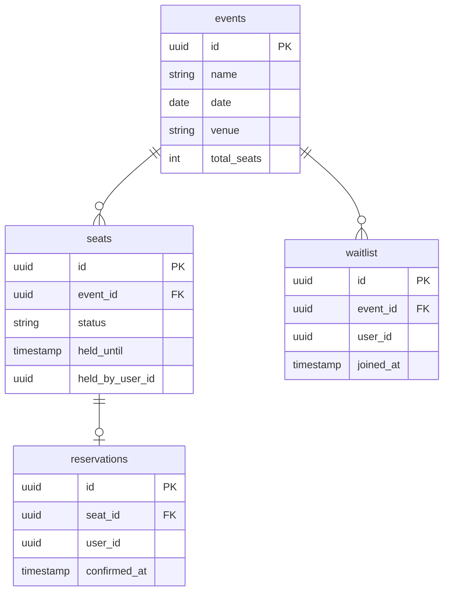

# System rezerwacji biletów

---

## Kontekst

Zespół Antoniego Chmieli i Stanisława Ogonowskiego buduje, na zaliczenie przedmiotu Bazy Danych II, projekt składający się z:
- nieskomplikowanej bazy danych,
- backendu komunikującego się z wspomnianą bazą danych,
- _(opcjonalnie)_ interfejsu użytkownika pozwalającego na komunikację backendu lub wgląd do niego.

Projekt powinien przede wszystkim demonstrować współpracę serwisów backendu i bazy danych, rozwiązującą realistyczny problem z wybranej domeny biznesowej, a niekoniecznie wyrafinowaną schemę bazy danych.

---

## Decyzja

Zbudujemy REST API rozwiązujące **problem rezerwacji biletów na wydarzenia socjalne z wysokim popytem**. System powinien być skalowalny i móc obsługiwać setki zapytań na sekundę.

Obraliśmy następujący stos technologiczny:

- **PostgreSQL**: baza danych
- **Rust**: język programowania implementacji backendu
  - **axum**: asynchroniczny framework HTTP
  - **sqlx**: asynchroniczny dostęp do bazy danych PostgreSQL
  - **tokio**: zadania w tle (background tasks)
  - _(opcjonalnie)_ autentykacja przez JWT
- _(opcjonalnie)_ **React**: frontend umożliwiający podgląd rezerwacji biletów

Lokalnie uruchomione serwisy porozumieją się przez setup Docker Compose. W produkcyjnych warunkach zapewne użylibyśmy serwisów serverless (np. AWS).

### Flow użytkownika

1. Użytkownik zgłasza chęć zakupu biletu.
  - Jeśli był pierwszy, bilet zostaje zarezerwowany w jego imieniu. Ta rezerwacja określoną liczbę minut _n_.
    * Bilet jest zarezerwowany dla użytkownika. Użytkownik może uiścić opłatę za bilet.
      - Jeśli zrobi to w ciągu _n_ minut, użytkownik oficjalnie staje się właścicielem biletu. Koniec flowu.
      - W przeciwnym przypadku, następny użytkownik w waitliście (priorytetem czasu dołączenia) zostaje powiadomiony o możliwości kupna biletu. Flow wraca do kroku 2 dla tego użytkownika.
  - W przeciwnym przypadku, użytkownik zostaje dodany do tzw. "waitlisty", w istocie kolejki.
     * Analogicznie: jeśli wszyscy użytkownicy, którzy zgłosili się do waitlisty przed użytkownikiem przeoczą zapłatę, użytkownik zostaje nowym właścicielem rezerwacji i zyskuje możliwość zapłaty i zakupu biletu.

### Schema bazy danych

W razie rozszerzenia funkcjonalności projektu, schema może wzrosnąć o dodatkowe tabele, ale nadal powinna pozostać stosunkowo prosta.

---

## Zalety

PostgreSQL:
- Składnia `SELECT FOR UPDATE SKIP LOCKED` może zająć się współbieżnymi lockami na miejsce bez deadlocków
- `LISTEN / NOTIFY` jako pierwszoklasowe wsparcie Postgresa dla wzorca pub/sub
- Izolacja per-transakcja zapobiega podwójnym rezerwacjom

Rust:
- Pierwszoklasowe wsparcie asynchroniczności, kluczowe w tego rodzaju projekcie
- `sqlx` weryfikuje poprawność kwerend SQL at compile-time
- Naturalne wykorzystanie "zamiatającego" background task w Tokio 

Ponadto:
- Schema jest prosta i łatwa do zrozumienia. Faktyczne wyrafinowanie leży w logice
- Projekt jest testowalny w realistycznych warunkach (np. `hurl`)

## Wady i ryzyka

- Składnia `LISTEN / NOTIFY` i jej powiązanie z SSE mogą być nietrywialne do zaimplementowania
- Wzorzec "zamiatania" zamiast taska z timeoutem, który nasłuchuje ewentualnego sygnału przedwczesnego zakończenia, gwarantuje spójność zdarzeniową (eventual consistency), ale nie jej silny wariant. Istnieje opóźnienie pomiędzy przeoczeniem zapłaty przez jednego użytkownika w określonym czasie a powiadomieniu następnego użytkownika w waitliście o możliwości zakupu. Wybrano zamiatanie zamiast debounce, ponieważ jest to bardziej trwałe rozwiązanie, które oddelegowuje źródło prawdy co do martwych rezerwacji do bazy danych, zamiast pamięci backendu, który jest podatny na downtime
