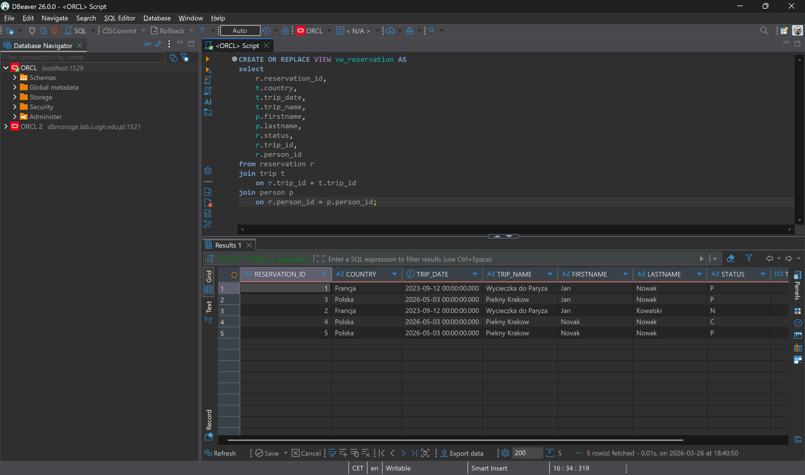
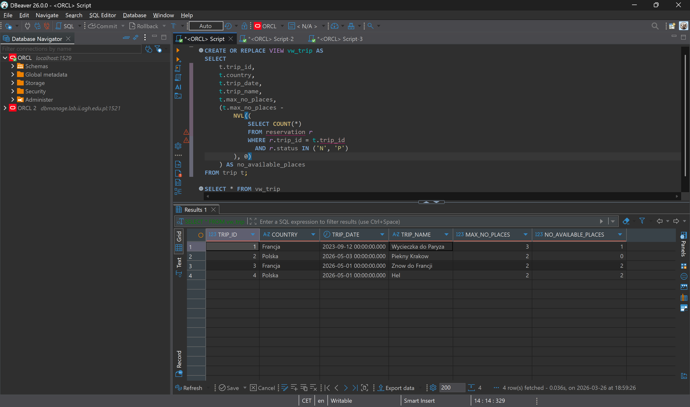
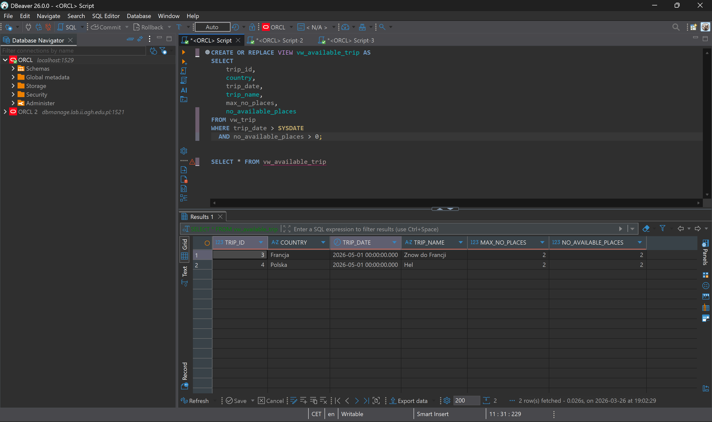
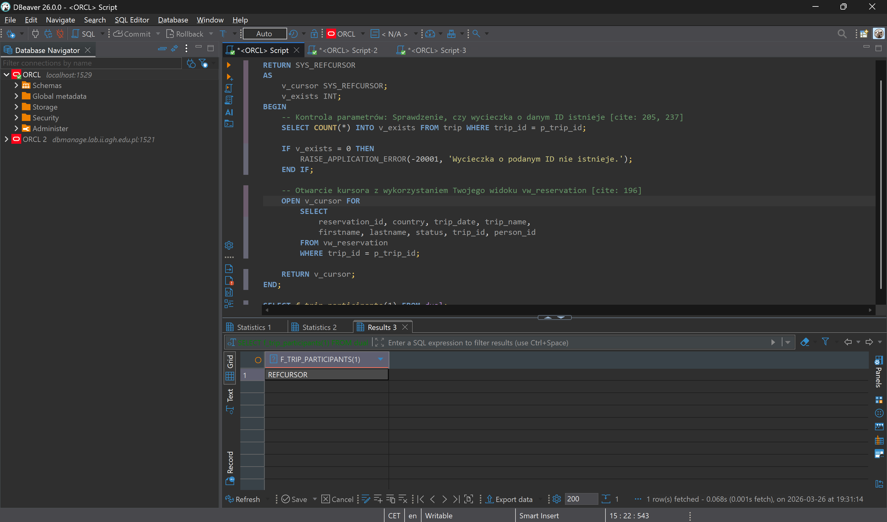
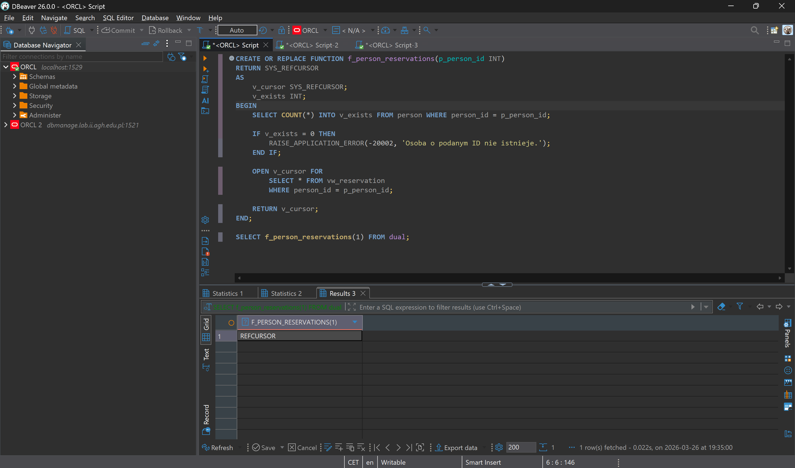
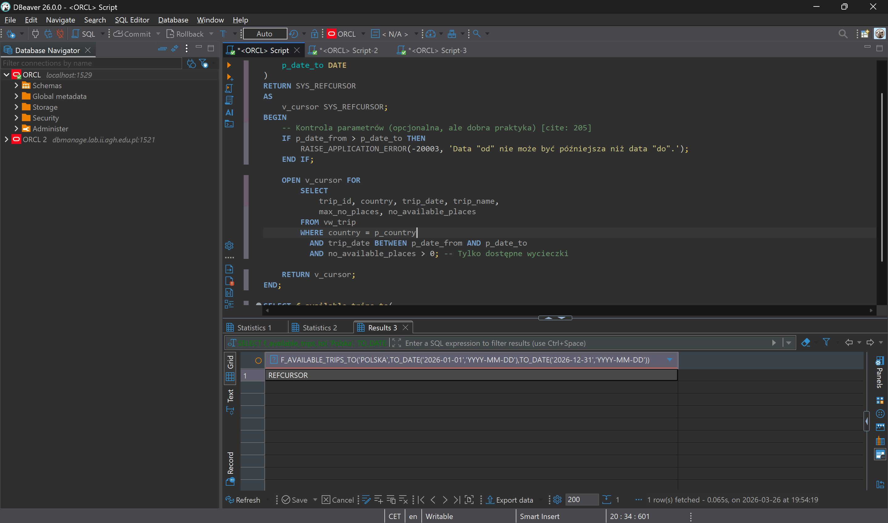

# Oracle PL/Sql

widoki, funkcje, procedury, triggery

ćwiczenie 1

---

Imiona i nazwiska autorów :

---

<style>
  code {
     font-size: 10pt;
  }
</style>

<style>
  {
    font-size: 16pt;
  }
</style>

<style>
 li, p {
    font-size: 14pt;
  }
</style>

<style>
 pre {
    font-size: 10pt;
  }
</style>

# Tabele


- `Trip` - wycieczki
  - `trip_id` - identyfikator, klucz główny
  - `trip_name` - nazwa wycieczki
  - `country` - nazwa kraju
  - `trip_date` - data
  - `max_no_places` - maksymalna liczba miejsc na wycieczkę
- `Person` - osoby
  - `person_id` - identyfikator, klucz główny
  - `firstname` - imię
  - `lastname` - nazwisko

- `Reservation` - rezerwacje/bilety na wycieczkę
  - `reservation_id` - identyfikator, klucz główny
  - `trip_id` - identyfikator wycieczki
  - `person_id` - identyfikator osoby
  - `status` - status rezerwacji
    - `N` – New - Nowa
    - `P` – Confirmed and Paid – Potwierdzona  i zapłacona
    - `C` – Canceled - Anulowana
- `Log` - dziennik zmian statusów rezerwacji
  - `log_id` - identyfikator, klucz główny
  - `reservation_id` - identyfikator rezerwacji
  - `log_date` - data zmiany
  - `status` - status

```sql
create sequence s_person_seq
   start with 1
   increment by 1;

create table person
(
  person_id int not null
      constraint pk_person
         primary key,
  firstname varchar(50),
  lastname varchar(50)
)

alter table person
    modify person_id int default s_person_seq.nextval;

```

```sql
create sequence s_trip_seq
   start with 1
   increment by 1;

create table trip
(
  trip_id int  not null
     constraint pk_trip
         primary key,
  trip_name varchar(100),
  country varchar(50),
  trip_date date,
  max_no_places int
);

alter table trip
    modify trip_id int default s_trip_seq.nextval;
```

```sql
create sequence s_reservation_seq
   start with 1
   increment by 1;

create table reservation
(
  reservation_id int not null
      constraint pk_reservation
         primary key,
  trip_id int,
  person_id int,
  status char(1)
);

alter table reservation
    modify reservation_id int default s_reservation_seq.nextval;


alter table reservation
add constraint reservation_fk1 foreign key
( person_id ) references person ( person_id );

alter table reservation
add constraint reservation_fk2 foreign key
( trip_id ) references trip ( trip_id );

alter table reservation
add constraint reservation_chk1 check
(status in ('N','P','C'));

```

```sql
create sequence s_log_seq
   start with 1
   increment by 1;


create table log
(
    log_id int not null
         constraint pk_log
         primary key,
    reservation_id int not null,
    log_date date not null,
    status char(1)
);

alter table log
    modify log_id int default s_log_seq.nextval;

alter table log
add constraint log_chk1 check
(status in ('N','P','C')) enable;

alter table log
add constraint log_fk1 foreign key
( reservation_id ) references reservation ( reservation_id );
```

---

# Dane

Należy wypełnić tabele przykładowymi danymi

- 4 wycieczki
- 10 osób
- 10 rezerwacji

Dane testowe powinny być różnorodne (wycieczki w przyszłości, wycieczki w przeszłości, rezerwacje o różnym statusie itp.) tak, żeby umożliwić testowanie napisanych procedur.

W razie potrzeby należy zmodyfikować dane tak żeby przetestować różne przypadki.

```sql
-- trip
insert into trip(trip_name, country, trip_date, max_no_places)
values ('Wycieczka do Paryza', 'Francja', to_date('2023-09-12', 'YYYY-MM-DD'), 3);

insert into trip(trip_name, country, trip_date,  max_no_places)
values ('Piekny Krakow', 'Polska', to_date('2026-05-03','YYYY-MM-DD'), 2);

insert into trip(trip_name, country, trip_date,  max_no_places)
values ('Znow do Francji', 'Francja', to_date('2026-05-01','YYYY-MM-DD'), 2);

insert into trip(trip_name, country, trip_date,  max_no_places)
values ('Hel', 'Polska', to_date('2026-05-01','YYYY-MM-DD'),  2);

-- person
insert into person(firstname, lastname)
values ('Jan', 'Nowak');

insert into person(firstname, lastname)
values ('Jan', 'Kowalski');

insert into person(firstname, lastname)
values ('Jan', 'Nowakowski');

insert into person(firstname, lastname)
values  ('Novak', 'Nowak');

-- reservation
-- trip1
insert  into reservation(trip_id, person_id, status)
values (1, 1, 'P');

insert into reservation(trip_id, person_id, status)
values (1, 2, 'N');

-- trip 2
insert into reservation(trip_id, person_id, status)
values (2, 1, 'P');

insert into reservation(trip_id, person_id, status)
values (2, 4, 'C');

-- trip 3
insert into reservation(trip_id, person_id, status)
values (2, 4, 'P');
```

proszę pamiętać o zatwierdzeniu transakcji

---

# Zadanie 0 - modyfikacja danych, transakcje

Należy przeprowadzić kilka eksperymentów związanych ze wstawianiem, modyfikacją i usuwaniem danych
oraz wykorzystaniem transakcji

Skomentuj dzialanie transakcji. Jak działa polecenie `commit`, `rollback`?.
Co się dzieje w przypadku wystąpienia błędów podczas wykonywania transakcji? Porównaj sposób programowania operacji wykorzystujących transakcje w Oracle PL/SQL ze znanym ci systemem/językiem MS Sqlserver T-SQL

pomocne mogą być materiały dostępne są w UPEL:

https://upel.agh.edu.pl/mod/folder/view.php?id=411834

w szczególności dokumenty: `10_modyf_ora_north.pdf`, `20_ora_plsql_north.pdf`

```sql

-- przyklady, kod, zrzuty ekranów, komentarz ...

```

---

# Zadanie 1 - widoki

Tworzenie widoków. Należy przygotować kilka widoków ułatwiających dostęp do danych. Należy zwrócić uwagę na strukturę kodu (należy unikać powielania kodu)

Widoki:

- `vw_reservation`
  - widok łączy dane z tabel: `trip`, `person`, `reservation`
  - zwracane dane: `reservation_id`, `country`, `trip_date`, `trip_name`, `firstname`, `lastname`, `status`, `trip_id`, `person_id`
- `vw_trip`
  - widok pokazuje liczbę wolnych miejsc na każdą wycieczkę
  - zwracane dane: `trip_id`, `country`, `trip_date`, `trip_name`, `max_no_places`, `no_available_places` (liczba wolnych miejsc)
- `vw_available_trip`
  - podobnie jak w poprzednim punkcie, z tym że widok pokazuje jedynie dostępne wycieczki (takie które są w przyszłości i są na nie wolne miejsca)

Proponowany zestaw widoków można rozbudować wedle uznania/potrzeb

- np. można dodać nowe/pomocnicze widoki, funkcje
- np. można zmienić def. widoków, dodając nowe/potrzebne pola

# Zadanie 1 - rozwiązanie

```sql

-- wyniki, kod, zrzuty ekranów, komentarz ...
-- vw_reservation
CREATE OR REPLACE VIEW vw_reservation AS
select
    r.reservation_id,
    t.country,
    t.trip_date,
    t.trip_name,
    p.firstname,
    p.lastname,
    r.status,
    r.trip_id,
    r.person_id
from reservation r
join trip t
    on r.trip_id = t.trip_id
join person p
    on r.person_id = p.person_id;
```



```sql
-- vw_trip
CREATE OR REPLACE VIEW vw_trip AS
SELECT
    t.trip_id,
    t.country,
    t.trip_date,
    t.trip_name,
    t.max_no_places,
    (t.max_no_places -
        NVL((
            SELECT COUNT(*)
            FROM reservation r
            WHERE r.trip_id = t.trip_id
              AND r.status IN ('N', 'P')
        ), 0)
    ) AS no_available_places
FROM trip t;
```


```sql
--vw_available_trip
CREATE OR REPLACE VIEW vw_available_trip AS
SELECT
    trip_id,
    country,
    trip_date,
    trip_name,
    max_no_places,
    no_available_places
FROM vw_trip
WHERE trip_date > SYSDATE
  AND no_available_places > 0;
```



---

# Zadanie 2 - funkcje

Tworzenie funkcji pobierających dane/tabele. Podobnie jak w poprzednim przykładzie należy przygotować kilka funkcji ułatwiających dostęp do danych

Procedury:

- `f_trip_participants`
  - zadaniem funkcji jest zwrócenie listy uczestników wskazanej wycieczki
  - parametry funkcji: `trip_id`
  - funkcja zwraca podobny zestaw danych jak widok `vw_eservation`
- `f_person_reservations`
  - zadaniem funkcji jest zwrócenie listy rezerwacji danej osoby
  - parametry funkcji: `person_id`
  - funkcja zwraca podobny zestaw danych jak widok `vw_reservation`
- `f_available_trips_to`
  - zadaniem funkcji jest zwrócenie listy wycieczek do wskazanego kraju, dostępnych w zadanym okresie czasu (od `date_from` do `date_to`)
    - dostępnych czyli takich na które są wolne miejsca
  - parametry funkcji: `country`, `date_from`, `date_to`

Funkcje powinny zwracać tabelę/zbiór wynikowy. Należy rozważyć dodanie kontroli parametrów, (np. jeśli parametrem jest `trip_id` to można sprawdzić czy taka wycieczka istnieje). Podobnie jak w przypadku widoków należy zwrócić uwagę na strukturę kodu

Czy kontrola parametrów w przypadku funkcji ma sens?

- jakie są zalety/wady takiego rozwiązania?

Proponowany zestaw funkcji można rozbudować wedle uznania/potrzeb

- np. można dodać nowe/pomocnicze funkcje/procedury

# Zadanie 2 - rozwiązanie

```sql

-- wyniki, kod, zrzuty ekranów, komentarz ...

--f_trip_participants
CREATE OR REPLACE FUNCTION f_trip_participants(p_trip_id INT)
RETURN SYS_REFCURSOR
AS
    v_cursor SYS_REFCURSOR;
    v_exists INT;
BEGIN
    SELECT COUNT(*) INTO v_exists FROM trip WHERE trip_id = p_trip_id;
    
    IF v_exists = 0 THEN
        RAISE_APPLICATION_ERROR(-20001, 'Wycieczka o podanym ID nie istnieje.');
    END IF;
    OPEN v_cursor FOR
        SELECT 
            reservation_id, country, trip_date, trip_name, 
            firstname, lastname, status, trip_id, person_id
        FROM vw_reservation
        WHERE trip_id = p_trip_id;

    RETURN v_cursor;
END;
```



```sql
CREATE OR REPLACE FUNCTION f_person_reservations(p_person_id INT)
RETURN SYS_REFCURSOR
AS
    v_cursor SYS_REFCURSOR;
    v_exists INT;
BEGIN
    SELECT COUNT(*) INTO v_exists FROM person WHERE person_id = p_person_id;
    
    IF v_exists = 0 THEN
        RAISE_APPLICATION_ERROR(-20002, 'Osoba o podanym ID nie istnieje.');
    END IF;

    OPEN v_cursor FOR
        SELECT * FROM vw_reservation 
        WHERE person_id = p_person_id;

    RETURN v_cursor;
END;
```


```sql
CREATE OR REPLACE FUNCTION f_available_trips_to(
    p_country VARCHAR2, 
    p_date_from DATE, 
    p_date_to DATE
)
RETURN SYS_REFCURSOR
AS
    v_cursor SYS_REFCURSOR;
BEGIN
    IF p_date_from > p_date_to THEN
        RAISE_APPLICATION_ERROR(-20003, 'Data "od" nie może być późniejsza niż data "do".');
    END IF;

    OPEN v_cursor FOR
        SELECT 
            trip_id, country, trip_date, trip_name, 
            max_no_places, no_available_places
        FROM vw_trip
        WHERE country = p_country
          AND trip_date BETWEEN p_date_from AND p_date_to
          AND no_available_places > 0;

    RETURN v_cursor;
END;
```


---

# Zadanie 3 - procedury

Tworzenie procedur modyfikujących dane. Należy przygotować zestaw procedur pozwalających na modyfikację danych oraz kontrolę poprawności ich wprowadzania

Procedury

- `p_add_reservation`
  - zadaniem procedury jest dopisanie nowej rezerwacji
  - parametry: `trip_id`, `person_id`
  - procedura powinna kontrolować czy wycieczka jeszcze się nie odbyła, i czy sa wolne miejsca
  - procedura powinna również dopisywać inf. do tabeli `log`
- `p_modify_reservation_status`
  - zadaniem procedury jest zmiana statusu rezerwacji
  - parametry: `reservation_id`, `status`
  - dopuszczalne są wszystkie zmiany statusu
    - ale procedura powinna kontrolować czy taka zmiana jest możliwa, np. zmiana statusu już anulowanej wycieczki (przywrócenie do stanu aktywnego nie zawsze jest możliwa – może już nie być miejsc)
  - procedura powinna również dopisywać inf. do tabeli `log`
- `p_modify_max_no_places`
  - zadaniem procedury jest zmiana maksymalnej liczby miejsc na daną wycieczkę
  - parametry: `trip_id`, `max_no_places`
  - nie wszystkie zmiany liczby miejsc są dozwolone, nie można zmniejszyć liczby miejsc na wartość poniżej liczby zarezerwowanych miejsc

Należy rozważyć użycie transakcji

- czy należy użyć `commit` wewnątrz procedury w celu zatwierdzenia transakcji
  - jakie są tego konsekwencje

Należy zwrócić uwagę na kontrolę parametrów (np. jeśli parametrem jest trip_id to należy sprawdzić czy taka wycieczka istnieje, jeśli robimy rezerwację to należy sprawdzać czy są wolne miejsca itp..)

Proponowany zestaw procedur można rozbudować wedle uznania/potrzeb

- np. można dodać nowe/pomocnicze funkcje/procedury

# Zadanie 3 - rozwiązanie

```sql

-- p_add_reservation
CREATE OR REPLACE PROCEDURE p_add_reservation(p_trip_id INT, p_person_id INT)
AS
    v_available_places INT;
    v_trip_date DATE;
    v_trip_exists INT;
    v_person_exists INT;
    v_reservation_id INT;
BEGIN
    SELECT COUNT(*) INTO v_trip_exists FROM trip WHERE trip_id = p_trip_id;
    IF v_trip_exists = 0 THEN
        RAISE_APPLICATION_ERROR(-20001, 'Wycieczka nie istnieje.');
    END IF;

    SELECT COUNT(*) INTO v_person_exists FROM person WHERE person_id = p_person_id;
    IF v_person_exists = 0 THEN
        RAISE_APPLICATION_ERROR(-20002, 'Osoba nie istnieje.');
    END IF;

    SELECT no_available_places, trip_date INTO v_available_places, v_trip_date
    FROM vw_trip
    WHERE trip_id = p_trip_id;

    IF v_trip_date <= SYSDATE THEN
        RAISE_APPLICATION_ERROR(-20010, 'Wycieczka już się odbyła lub jest dzisiaj.');
    END IF;

    IF v_available_places <= 0 THEN
        RAISE_APPLICATION_ERROR(-20011, 'Brak wolnych miejsc na tę wycieczkę.');
    END IF;

    INSERT INTO reservation(trip_id, person_id, status)
    VALUES (p_trip_id, p_person_id, 'N')
    RETURNING reservation_id INTO v_reservation_id;

    INSERT INTO log(reservation_id, log_date, status)
    VALUES (v_reservation_id, SYSDATE, 'N');
END;
/

-- p_modify_reservation_status
CREATE OR REPLACE PROCEDURE p_modify_reservation_status(p_reservation_id INT, p_status CHAR)
AS
    v_current_status CHAR(1);
    v_trip_id INT;
    v_available_places INT;
    v_reservation_exists INT;
BEGIN
    SELECT COUNT(*) INTO v_reservation_exists FROM reservation WHERE reservation_id = p_reservation_id;
    IF v_reservation_exists = 0 THEN
        RAISE_APPLICATION_ERROR(-20003, 'Rezerwacja nie istnieje.');
    END IF;

    SELECT status, trip_id INTO v_current_status, v_trip_id
    FROM reservation
    WHERE reservation_id = p_reservation_id;

    IF v_current_status = 'C' AND p_status IN ('N', 'P') THEN
        SELECT no_available_places INTO v_available_places
        FROM vw_trip
        WHERE trip_id = v_trip_id;
        
        IF v_available_places <= 0 THEN
            RAISE_APPLICATION_ERROR(-20012, 'Brak wolnych miejsc, aby przywrócić rezerwację.');
        END IF;
    END IF;

    UPDATE reservation
    SET status = p_status
    WHERE reservation_id = p_reservation_id;

    INSERT INTO log(reservation_id, log_date, status)
    VALUES (p_reservation_id, SYSDATE, p_status);
END;
/

-- p_modify_max_no_places
CREATE OR REPLACE PROCEDURE p_modify_max_no_places(p_trip_id INT, p_max_no_places INT)
AS
    v_reserved_places INT;
    v_trip_exists INT;
BEGIN
    SELECT COUNT(*) INTO v_trip_exists FROM trip WHERE trip_id = p_trip_id;
    IF v_trip_exists = 0 THEN
        RAISE_APPLICATION_ERROR(-20001, 'Wycieczka nie istnieje.');
    END IF;

    SELECT COUNT(*) INTO v_reserved_places
    FROM reservation
    WHERE trip_id = p_trip_id AND status IN ('N', 'P');

    IF p_max_no_places < v_reserved_places THEN
        RAISE_APPLICATION_ERROR(-20013, 'Liczba wprowadzonych miejsc nie może być mniejsza od zarezerwowanych.');
    END IF;

    UPDATE trip
    SET max_no_places = p_max_no_places
    WHERE trip_id = p_trip_id;
END;
/

/*
Komentarz dotyczący transakcji:
Należy unikać używania polecenia 'COMMIT' bezpośrednio w procedurach PL/SQL.
Procedura powinna stanowić logiczną jednostkę, a decyzję o zatwierdzeniu zmian (COMMIT) 
lub ich wycofaniu (ROLLBACK) powierza się programowi lub skryptowi, który wywołuje 
procedury. Umieszczenie COMMIT w środku odbiera możliwość grupowania operacji w większe 
transakcje (np. wstawienie 5 rezerwacji naraz i zbiorczy COMMIT). 
Użyty tutaj mechanizm 'RAISE_APPLICATION_ERROR' informuje wywołującego o błędzie, 
niezatwierdzając dotychczasowych niepoprawnych stanów w bazie, dzięki czemu transakcję
można wycofać.
*/

```

---

# Zadanie 4 - triggery

Zmiana strategii zapisywania do dziennika rezerwacji. Realizacja przy pomocy triggerów

Należy wprowadzić zmianę, która spowoduje, że zapis do dziennika będzie realizowany przy pomocy trigerów

Triggery:

- trigger/triggery obsługujące
  - dodanie rezerwacji
  - zmianę statusu
- trigger zabraniający usunięcia rezerwacji

Oczywiście po wprowadzeniu tej zmiany należy "uaktualnić" procedury modyfikujące dane.

> UWAGA
> Należy stworzyć nowe wersje tych procedur (dodając do nazwy dopisek 4 - od numeru zadania). Poprzednie wersje procedur należy pozostawić w celu umożliwienia weryfikacji ich poprawności

Należy przygotować procedury: `p_add_reservation_4`, `p_modify_reservation_status_4` , `p_modify_reservation_4`

# Zadanie 4 - rozwiązanie

```sql

-- trg_reservation_log
CREATE OR REPLACE TRIGGER trg_reservation_log
AFTER INSERT OR UPDATE OF status ON reservation
FOR EACH ROW
BEGIN
    INSERT INTO log(reservation_id, log_date, status)
    VALUES (:NEW.reservation_id, SYSDATE, :NEW.status);
END;
/

-- trg_reservation_prevent_delete
CREATE OR REPLACE TRIGGER trg_reservation_prevent_delete
BEFORE DELETE ON reservation
FOR EACH ROW
BEGIN
    RAISE_APPLICATION_ERROR(-20004, 'Usunięcie rezerwacji jest zabronione.');
END;
/

-- p_add_reservation_4
CREATE OR REPLACE PROCEDURE p_add_reservation_4(p_trip_id INT, p_person_id INT)
AS
    v_available_places INT;
    v_trip_date DATE;
BEGIN
    SELECT no_available_places, trip_date INTO v_available_places, v_trip_date
    FROM vw_trip
    WHERE trip_id = p_trip_id;

    IF v_trip_date <= SYSDATE THEN
        RAISE_APPLICATION_ERROR(-20010, 'Wycieczka już się odbyła.');
    END IF;

    IF v_available_places <= 0 THEN
        RAISE_APPLICATION_ERROR(-20011, 'Brak wolnych miejsc.');
    END IF;

    INSERT INTO reservation(trip_id, person_id, status)
    VALUES (p_trip_id, p_person_id, 'N');
END;
/

-- p_modify_reservation_status_4
CREATE OR REPLACE PROCEDURE p_modify_reservation_status_4(p_reservation_id INT, p_status CHAR)
AS
    v_current_status CHAR(1);
    v_trip_id INT;
    v_available_places INT;
BEGIN
    SELECT status, trip_id INTO v_current_status, v_trip_id
    FROM reservation
    WHERE reservation_id = p_reservation_id;

    IF v_current_status = 'C' AND p_status IN ('N', 'P') THEN
        SELECT no_available_places INTO v_available_places
        FROM vw_trip
        WHERE trip_id = v_trip_id;
        
        IF v_available_places <= 0 THEN
            RAISE_APPLICATION_ERROR(-20012, 'Brak wolnych miejsc, aby przywrócić rezerwację.');
        END IF;
    END IF;

    UPDATE reservation
    SET status = p_status
    WHERE reservation_id = p_reservation_id;
END;
/

-- p_modify_reservation_4 (aka p_modify_max_no_places_4)
CREATE OR REPLACE PROCEDURE p_modify_reservation_4(p_trip_id INT, p_max_no_places INT)
AS
    v_reserved_places INT;
BEGIN
    SELECT COUNT(*) INTO v_reserved_places
    FROM reservation
    WHERE trip_id = p_trip_id AND status IN ('N', 'P');

    IF p_max_no_places < v_reserved_places THEN
        RAISE_APPLICATION_ERROR(-20013, 'Liczba miejsc mniejsza od zarezerwowanych.');
    END IF;

    UPDATE trip
    SET max_no_places = p_max_no_places
    WHERE trip_id = p_trip_id;
END;
/

```

---

# Zadanie 5 - triggery

Zmiana strategii kontroli dostępności miejsc. Realizacja przy pomocy triggerów

Należy wprowadzić zmianę, która spowoduje, że kontrola dostępności miejsc na wycieczki (przy dodawaniu nowej rezerwacji, zmianie statusu) będzie realizowana przy pomocy trigerów

Triggery:

- Trigger/triggery obsługujące:
  - dodanie rezerwacji
  - zmianę statusu

Oczywiście po wprowadzeniu tej zmiany należy "uaktualnić" procedury modyfikujące dane.

> UWAGA
> Należy stworzyć nowe wersje tych procedur (np. dodając do nazwy dopisek 5 - od numeru zadania). Poprzednie wersje procedur należy pozostawić w celu umożliwienia weryfikacji ich poprawności.

Należy przygotować procedury: `p_add_reservation_5`, `p_modify_reservation_status_5`, ...

# Zadanie 5 - rozwiązanie

```sql

-- trg_check_available_places_5
CREATE OR REPLACE TRIGGER trg_check_available_places_5
BEFORE INSERT OR UPDATE OF status ON reservation
FOR EACH ROW
DECLARE
    v_available_places INT;
    v_trip_date DATE;
    PRAGMA AUTONOMOUS_TRANSACTION;
BEGIN
    IF INSERTING OR (UPDATING AND :OLD.status = 'C' AND :NEW.status IN ('N', 'P')) THEN
        SELECT no_available_places, trip_date INTO v_available_places, v_trip_date
        FROM vw_trip
        WHERE trip_id = :NEW.trip_id;

        IF INSERTING AND v_trip_date <= SYSDATE THEN
            RAISE_APPLICATION_ERROR(-20010, 'Wycieczka już się odbyła lub jest dzisiaj.');
        END IF;

        IF v_available_places <= 0 THEN
            RAISE_APPLICATION_ERROR(-20011, 'Brak wolnych miejsc na tę wycieczkę.');
        END IF;
    END IF;
    COMMIT;
END;
/

-- p_add_reservation_5
CREATE OR REPLACE PROCEDURE p_add_reservation_5(p_trip_id INT, p_person_id INT)
AS
BEGIN
    INSERT INTO reservation(trip_id, person_id, status)
    VALUES (p_trip_id, p_person_id, 'N');
END;
/

-- p_modify_reservation_status_5
CREATE OR REPLACE PROCEDURE p_modify_reservation_status_5(p_reservation_id INT, p_status CHAR)
AS
BEGIN
    UPDATE reservation
    SET status = p_status
    WHERE reservation_id = p_reservation_id;
END;
/

-- p_modify_max_no_places_5
CREATE OR REPLACE PROCEDURE p_modify_max_no_places_5(p_trip_id INT, p_max_no_places INT)
AS
    v_reserved_places INT;
BEGIN
    SELECT COUNT(*) INTO v_reserved_places
    FROM reservation
    WHERE trip_id = p_trip_id AND status IN ('N', 'P');

    IF p_max_no_places < v_reserved_places THEN
        RAISE_APPLICATION_ERROR(-20013, 'Liczba miejsc nie może być mniejsza od już zarezerwowanych.');
    END IF;

    UPDATE trip
    SET max_no_places = p_max_no_places
    WHERE trip_id = p_trip_id;
END;
/

```

---

# Zadanie - podsumowanie

Porównaj sposób programowania w systemie Oracle PL/SQL ze znanym ci systemem/językiem MS Sqlserver T-SQL

```sql

-- komentarz ...

```
